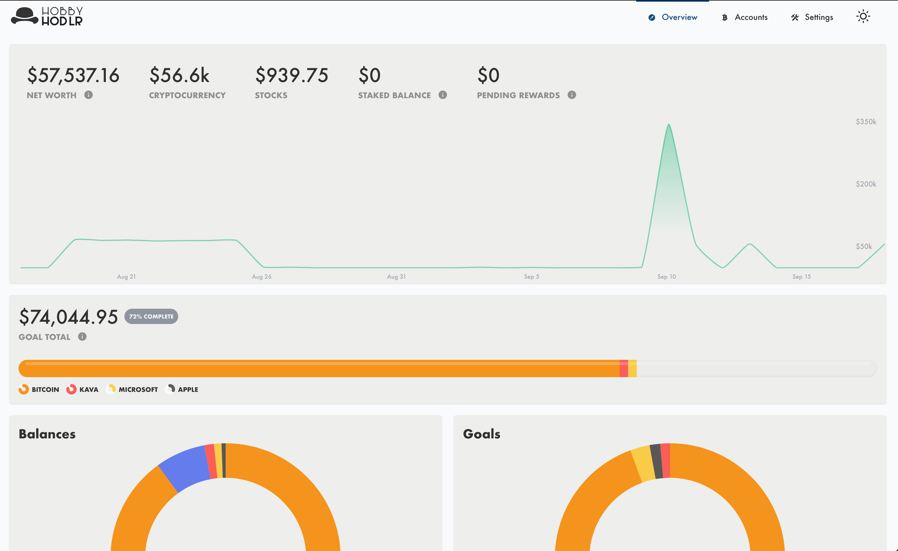
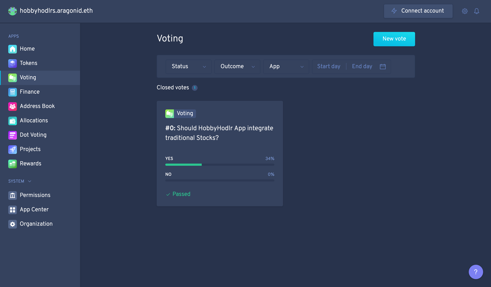

<center>

</center>

#### Your Decentralized Finance Portfolio, Goals & Projections Tool
This is a hobby project built during [Hack Money Hackathon](https://ethglobal.online/)!
I built this because my wife wanted an easy way to view a crypto portfolio.

### [View Visual Walkthrough 🕺🏻 -->](./static/docs/walkthrough.md)



## Quick Setup Using Docker:
```bash
git clone https://gitlab.com/hobbyhodlr/portfolio.git
cd hobby-hodlr
cp secrets/.env.example secrets/.env
docker run --rm -it -v $(pwd)/secrets:/home/node/app/secrets hobbyhodlr/portfolio:latest run init
docker-compose up
```
----

## Why use HobbyHodlr?

HobbyHodlr is built for you! There's a huge amount of features built with privacy, research & alerting in mind.

You should use HobbyHodlr if you:
* Have 1 or multiple cryptocurrency accounts
* Want an easy view of ALL your account holdings
* Want to track portfolio performance with goal oriented balances
* Can run a small raspberry pi or node.js server
* Want to research tradition vs cryptocurrency assets

Here's a quick list of things HobbyHodlr can do:

| Feature | Supported | Notes |
| ------- | ------- | ------- |
| Blockchain Account Balances | ✅ | Supports 10 blockchains natively |
| Portfolio Hodlings | ✅ | Easily view multiple accounts realtime & historical performance |
| Allocation Goals | ✅ | Keep a focussed and balanced portfolio |
| Price Alerts | ✅ | Get notified via Slack when prices move on your goal or account assets |
| Staking Alerts | ✅ | Get notified when you need to claim or adjust your staked assets |
| Privacy | ✅ | Account addresses, balances, goals are **only** stored locally |
| NO Analytics | ✅ | You read that right. There is **NO** analytic tracking code, your portfolio is your secret |
| Mobile Friendly | ✅ | View all features within mobile format on-the-go! |
| Local Network Friendly | ✅ | Easily host on a home network with a raspberry pi |
| Staking Reward Calculation | ✅ | Get compounded earning calculations for a PoS asset |
| Loan Interest Calculation | ✅ | See compounded earnings for loan assets |
| Traditional VS Crypto | ✅ | Check how any cryptocurrency is doing against S&P 500 and Gold |
| Asset Swap Comparison | ✅ | See if & when its a good time to swap holdings between two assets |
| Traditional Stocks | ✅ | Create goals and account balances for traditional stocks, view full comparison between all hodlings |
| HobbyHodlr DAO | 🔜 | Vote for new features, support continued development |

----

## Integrations Setup

HobbyHodlr uses several services to enable data for things like asset prices or asset availability. Set these keys in the Settings page.

The following accounts are optional for HobbyHodlr to work correctly:

* [Amberdata.io](https://amberdata.io/onboarding) - For retrieving blockchain assets, account balances
* [Portis Wallet](https://portis.io/) - For retrieving blockchain account addresses
* [Slack Webhook (Coming Soon)](https://slack.com/help/articles/115005265063-Incoming-Webhooks-for-Slack) & [Rocket.Chat (Coming Soon)](#) - For alerting prices, staking updates
* [Quandl API Key](https://www.quandl.com/search?filters=%5B%22Free%22%5D&query=gold) - For retrieving gold prices
* [Alphavantage API Key](https://www.alphavantage.co/) - For retrieving traditional stocks data

## Server Setup

This repo is built to be run on a local server or computer for local network monitoring. It uses mongo database, and keeps track of minimal information for things like price and account history. Setup uses the following commands:

```
$ npm i
$ npm run build
$ npm start
```

Once the server is running, navigate to your local IP, at port 2000. Example: http://localhost:2000

----
## Using Docker:
```bash
git clone https://gitlab.com/TrevorJTClarke/hobby-hodlr.git
cd hobby-hodlr
cp secrets/.env.example secrets/.env
docker run --rm -it -v $(pwd)/secrets:/home/node/app/secrets hobbyhodlr/portfolio:latest run init
docker-compose up
```
Run in detached mode (to suppress output):
```bash
docker-compose up -d
```


## Docker Setup

```bash
docker-compose up
```

If you make changes to the node app then run the following to rebuild the image
before launching containers:
```bash
docker-compose up --build
```
Note: The data for mongodb is stored in the `/data` folder.

### Inspecting the app
```bash
docker run --rm -it --entrypoint=/bin/bash hobbyhodlr/portfolio
```

### Inspecting the mongo database
If you want to inspect the mongo database and gain access to the [mongo shell](https://docs.mongodb.com/manual/mongo/), you
may do so with the following commands:
```bash
docker exec -it mongo /bin/bash
mongo "mongodb://$MONGO_USERNAME:$MONGO_PASSWORD@$MONGO_HOSTNAME/$MONGO_DATABASE?retryWrites=true&w=majority&authSource=admin"
```

The first command will launch a bash shell within the docker container running the
mongodb instance using docker's [exec command](https://docs.docker.com/engine/reference/commandline/exec/).
Then we use the mongo command, and the database url to connect
and launch the mongo shell.

### Buy me ☕️ Coffee?

I don't require this **at all**, but my ❤️ will be warmed by a tip for my caffeine addiction. ETH/ERCs: `0xd26261B7590FBC2c5a35866F31Ab8031fC71f805`

### Join the HobbyHodlr DAO!

Want to request new features, fund ongoing development or just shill HODL tokens? Request to join the [HobbyHodlr DAO](https://mainnet.aragon.org/#/hobbyhodlrs/0xfca15a0cfc64a01cec6de3dbcfbd01a1b663235f/) hosted on aragon.

#### Why a DAO?

A DAO is needed to fully decentralize ownership and governance of the HobbyHodlr project. The goal is to create a community driving the continued development of this project. Then with more support, each portfolio within local HobbyHodlr instances could launch a DAO which could effectively run like a decentralized hedge fund! Game ON.



Made with ❤️ by [@trevorjtclarke](https://gitlab.com/TrevorJTClarke)
