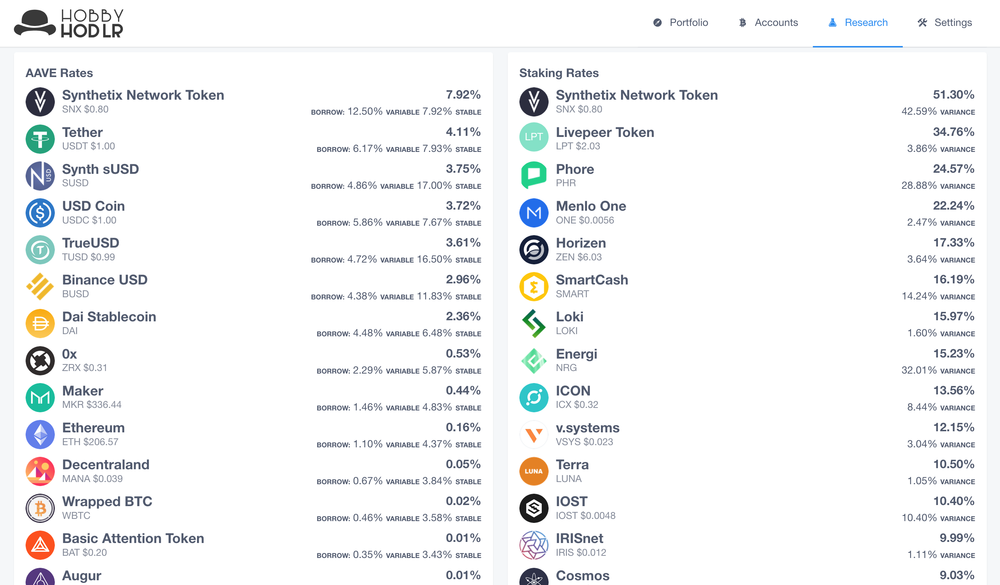

# HobbyHodlr - Visual Walkthrough 🕺🏻

Join me on a journey, starting with an empty canvas 🎨 we will add happy little accounts 💸, combine them with majestic goals 📊 and unveil a masterpiece HODL portfolio!

# Account Setup:

### Home Screen

Starting off with an empty setup, we begin at the home screen. We need to add a blockchain account!

### Add Account

There are several ways to add a new Account, which HobbyHodlr will cache locally and utilize many different APIs to get the account balance. Key note here is that the balances are retrieved as minimally as possible, therefore helping privacy. The balances can either be tracked with public APIs for dynamic balances, or with manual setup that doesn't use API balance lookup.

### Add Portis Accounts

Let's use the fastest example of how to add an Ethereum account. Clicking the Portis button, we will allow Portis to give us a list of Ethereum addresses to watch.

### Portis Configuration

Using Portis is simple, which allows quick loading of accounts without users having to remember long account names.

### Account Setup Complete!

### Adding Portfolio Goals

Now that you have an account, let's setup some goals! This will help you make smarter and more focussed trading decisions. Long term or short term HODLing should be goal oriented, so when the right time comes you can execute your growth plan! Adding a goal is simple:

1. Select the Cryptocurrency Symbol you want
2. Add the amount of **Units** to achieve

### Goals Added!

Here's what it looks like when you have 1 or more goal assets.

### Portfolio Overview

Now that the accounts and goals are all loaded, it's time to view the outcome! On the home dashboard, this portfolio shows account holdings for the past month, your progress toward the goals, all accounts and their balances.

These charts track automatically and in realtime, so as the market changes, your porfolio will accurately reflect the current market asset values. Checkout the breakdown of asset allocation, did you execute against the goals you wanted?

### Portfolio Alerts

Monitoring your portfolio and goals can be a daunting task! Alerting is setup to keep you informed about asset performance and required actions. Stay focussed on things you need to and get alerted when your portfolio needs attention.

#### Price alerts for goals or owned assets

#### Staking alerts for all accounts

# Research Tools:

### Passive Income, Do Your Research!

So you heard about earning interest by holding DAI? Or maybe you know that its possible to stake some tokens to earn more assets? What would happen if you held X asset for Y amount of time?

First up -- DAI! Everyone's favorite token for earning interest holding the token with AAVE, Compound or others.

Staking! MMmmmmmm tasty staking... How does Tezos line up with earning more XTZ? Using the staking rewards here, you can see there is a fairly stable amount of interest, the more you HODL the more you earn!

How about other assets? We've got a huge list to research here, but research carefully... Not all assets are equal, or even safe! Here's a solid (not 100% coverage) list of assets for loans and staking. Notice, there is a rate AND a variance rate...

Let's take a look at a practical example how much a compounding variance rate really affects potential earnings. As you can see, huge rewards come with huge risk. Stay safe out there ;)

# WIP: Traditional Stocks Integation

While this project is geared to Cryptocurrency HODLing, it became clear that it could also be used for a full digital finance portfolio. Traditional stocks are widely available, and can be compared against crypto holdings within HobbyHodlr once this integration is complete.

# WIP: HobbyHodlr DAO (Decentralized Autonomous Organization)

I setup a DAO to help the ongoing progress and development of HobbyHodlr. [Join the DAO](https://mainnet.aragon.org/#/hobbyhodlrs/0xfca15a0cfc64a01cec6de3dbcfbd01a1b663235f/), and get some _HODL_ tokens.

